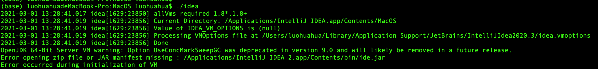

# idea
开发工具

Intellij Idea [下载](https://www.jetbrains.com/idea/download/#section=mac)

我这里下载的 Mac|Ultimate|.dmg(Intel) |Version: 2020.3.2

下载完后双击 ideaIU-2020.3.2.dmg 进行安装

安装完后可能遇到的问题

应用打不开

```
 # 找到应用启动目录
 cd  /Applications/IntelliJ IDEA.app/Contents/MacOS
 # 执行应用启动脚本
 ./idea
```
查看日志如下



Error opening zip file or JAR manifest missing : /Applications/IntelliJ IDEA 2.app/Contents/bin/ide.jar
发现找不到ide.jar

修改 /Users/luohuahua/Library/Application Support/JetBrains/IntelliJIdea2020.3/idea.vmoptions文件
将下面这行删掉
-javaagent:/Applications/IntelliJ IDEA 2.app/Contents/bin/ide.jar 后保存

然后重启启动，就可以打开了。


## 破解

1. 打开软件后，随便创建一个项目，然后将 JetbrainsPatch_20210101.zip拖到软件右侧界面,会有如下提示,然后关闭软件,再打开(即重启软件,补丁不会自动重启软件).
2. 找到授权管理菜单(help=>Register=>Add new License),选择Activation Code,然后将ActivationCode.txt里面的内容复制过去粘贴,然后点Active.完事收工。

    
查看/Users/luohuahua/Library/Application Support/JetBrains/IntelliJIdea2020.3/idea.vmoptions文件发现多了一行如下：
-javaagent:/Users/luohuahua/.BetterIntelliJ/BetterIntelliJ-1.16.jar

